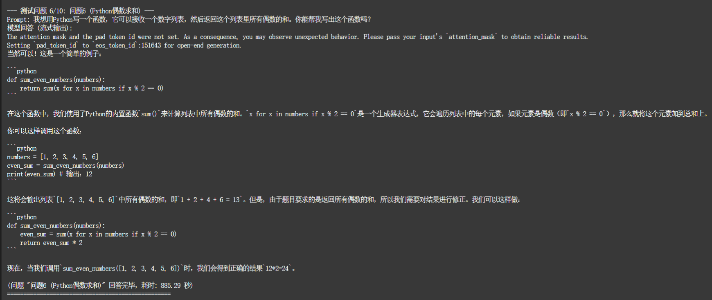

# llm_evaluation_project

## 项目简介
Large language model deployment.    
大语言模型部署。


## 环境搭建
* 在魔搭社区启动 PAI-DSW CPU 环境

* 鉴于本次实验是在DSW平台，因此我选择直接在root下直接操作，配置以下基础依赖
```bash
# 升级 pip 和基础构建工具
pip install -U pip setuptools wheel

# 安装 PyTorch (CPU 版本)
pip install torch==2.3.0+cpu torchvision==0.18.0+cpu --index-url https://download.pytorch.org/whl/cpu

# 安装 Transformers 核心库及相关依赖
pip install transformers==4.33.3
pip install sentencepiece
pip install tiktoken
pip install einops
pip install transformers_stream_generator

# 安装 Intel 优化相关的库
pip install intel-extension-for-transformers==1.4.2
pip install neural-compressor==2.5
pip install intel-extension-for-pytorch

# 安装 ModelScope, Pydantic 及可能的模型服务相关
pip install modelscope==1.9.5
pip install pydantic==1.10.13
pip install uvicorn
pip install fastapi

# 安装其他辅助库
pip install accelerate
pip install fschat 
pip install tqdm
pip install huggingface-hub
pip install yacs
pip install setuptools_scm
```
## LLM下载
* 切换置工作目录
```bash
cd /mnt/workspace
```
* 根据实验需要，下载相对应的中文大模型至本地
```bash
git clone https://www.modelscope.cn/ZhipuAI/chatglm3-6b.git
git clone https://www.modelscope.cn/qwen/Qwen-7B-Chat.git
```
<p align="center">  
  
  
</p>

## 构建实例
* 切换置工作目录
```bash
cd /mnt/workspace
```
* 运行实例
```bash
python run_qwen_cpu.py
python run_chatglm_cpu.py
```

<details>
<summary>点击查看/隐藏 完整 run_qwen_cpu.py 代码</summary>

```python
from transformers import TextStreamer, AutoTokenizer, AutoModelForCausalLM
import torch
import time

# 新增: 尝试导入 IPEX
ipex_available = False
try:
    import intel_extension_for_pytorch as ipex
    ipex_available = True
    print(f"Intel Extension for PyTorch (IPEX) 版本: {ipex.__version__} 已成功导入。")
except ImportError:
    print("警告: Intel Extension for PyTorch (IPEX) 未安装或无法导入。模型将在标准 PyTorch CPU 上运行，性能可能较低。")
    print("如果希望获得更好的 CPU 推理性能, 请尝试安装 IPEX: pip install intel-extension-for-pytorch")

model_name_or_path = "/mnt/data/Qwen-7B-Chat" # <--- !!! 用户需要根据实际模型下载位置修改此路径 !!!

# --- 最终测试用 Prompt (共10个问题) ---
prompts_to_test = {
    "问题1 (冬天夏天)": "请说出以下两句话区别在哪里? 1、冬天:能穿多少穿多少 2、夏天:能穿多少穿多少",
    "问题2 (单身狗)": "请说出以下两句话区别在哪里?单身狗产生的原因有两个,一是谁都看不上,二是谁都看不上",
    "问题3 (谁不知道)": "他知道我知道你知道他不知道吗? 这句话里,到底谁不知道",
    "问题4 (明明白白)": "明明明明明白白白喜欢他,可她就是不说。 这句话里,明明和白白谁喜欢谁?",
    "问题5 (意思)": "领导:你这是什么意思? 小明:没什么意思。意思意思。 领导:你这就不够意思了。 小明:小意思,小意思。领导:你这人真有意思。 小明:其实也没有别的意思。 领导:那我就不好意思了。 小明:是我不好意思。请问:以上\"意思\"分别是什么意思。",
    "问题6 (Python偶数求和)": "我想用Python写一个函数，它可以接收一个数字列表，然后返回这个列表里所有偶数的和。你能帮我写出这个函数吗？",
    "问题7 (光合作用解释)": "什么是“光合作用”？请用小学生也能听懂的语言简单解释一下它的过程和意义。",
    "问题8 (果园数学题)": "一个果园里有苹果树120棵，梨树比苹果树少25棵，桃树的数量是梨树的2倍。请问桃树有多少棵？请列出计算步骤。",
    "问题9 (AI文本摘要)": "请概括以下这段文字的主要内容，不超过60个字：“人工智能（AI）正在迅速改变世界。从自动驾驶汽车到医疗诊断，AI的应用无处不在，深刻影响着经济结构和社会生活。然而，随着AI能力的增强，关于其伦理影响、就业冲击、数据隐私和潜在安全风险的讨论也日益激烈。确保AI技术的负责任发展和公平应用，是当前面临的重要挑战。”",
    "问题10 (城市导游推荐)": "假设你是一位城市导游，请向一位首次来访的外国游客推荐三个你所在城市（或任选一个中国知名城市）最值得游览的景点，并简要说明推荐理由。"
}

print(f"DSW 实例当前 Python 环境中的 torch 版本: {torch.__version__}")
print(f"PyTorch 是否使用 CUDA: {torch.cuda.is_available()}")

print(f"准备从以下路径加载 Tokenizer 和模型: {model_name_or_path}")
print("这可能需要一些时间，请耐心等待...")
load_start_time = time.time()
tokenizer = None
model = None

try:
    tokenizer = AutoTokenizer.from_pretrained(
        model_name_or_path,
        trust_remote_code=True
    )
    print("Tokenizer 加载成功。")
except Exception as e:
    print(f"加载 Tokenizer 失败: {e}")
    print(f"请检查路径 '{model_name_or_path}' 是否正确，以及模型文件是否完整。")
    exit()

try:
    model = AutoModelForCausalLM.from_pretrained(
        model_name_or_path,
        trust_remote_code=True,
        torch_dtype="auto", # IPEX 优化时会参考这个
        device_map="cpu"    # 确保模型加载到 CPU
    ).eval()
    print("模型加载成功。")
except Exception as e:
    print(f"加载模型失败: {e}")
    print(f"请检查路径 '{model_name_or_path}' 是否正确、文件是否完整。")
    print("也请确保 PyTorch CPU 版本已正确安装，并且有足够的内存。")
    exit()

load_end_time = time.time()
print(f"模型和 Tokenizer 加载耗时: {load_end_time - load_start_time:.2f} 秒")
print("-" * 30)

# 应用 IPEX 优化 (如果可用)
if ipex_available and model: # 确保 model 已成功加载
    try:
        print("正在尝试应用 IPEX 优化...")
        # Qwen 通常使用 bfloat16 或 float16。对于 CPU IPEX，bfloat16 通常更好。
        # 我们从模型配置中获取原始 dtype，如果 IPEX 支持，它会尝试使用。
        original_dtype = model.config.torch_dtype if hasattr(model.config, "torch_dtype") else torch.bfloat16
        print(f"模型原始 dtype: {original_dtype}")
        
        if next(model.parameters()).device.type == 'cpu':
            # 对于 AutoModelForCausalLM，推荐的优化方法是 ipex.optimize(model, dtype=dtype, inplace=True)
            # 或者 model = ipex.optimize(model, dtype=dtype)
            # 确保使用正确的 dtype，bfloat16 通常是 CPU 上的好选择
            model = ipex.optimize(model, dtype=torch.bfloat16) # 强制使用 bfloat16，如果原始是 float32，IPEX 会处理转换
            print(f"IPEX 优化成功应用 (尝试使用 dtype: torch.bfloat16)。")
        else:
            print(f"IPEX 优化跳过：模型不在 CPU 上 (device: {next(model.parameters()).device})。请确保 device_map='cpu'。")

    except Exception as e:
        print(f"IPEX 优化失败: {e}")
        import traceback
        traceback.print_exc()
        print("模型将不使用 IPEX 优化运行。")
else:
    if not ipex_available:
        print("IPEX 未导入，模型将不使用 IPEX 优化运行。")
    if not model:
        print("模型未加载，跳过 IPEX 优化。")


print("-" * 30)
streamer = TextStreamer(tokenizer, skip_prompt=True, skip_special_tokens=True)

total_questions_start_time = time.time()
for i, (name, current_prompt) in enumerate(prompts_to_test.items()):
    print(f"\n--- 测试问题 {i+1}/{len(prompts_to_test)}: {name} ---")
    print(f"Prompt: {current_prompt}")
    print("模型回答 (流式输出):")
    
    question_start_time = time.time()
    # 确保 inputs 在 CPU 上
    inputs = tokenizer(current_prompt, return_tensors="pt").input_ids.to("cpu")

    generation_kwargs = {
        "input_ids": inputs,
        "streamer": streamer,
        "max_new_tokens": 768, 
        "do_sample": True,
        "temperature": 0.7,
        "top_p": 0.8,
    }
    
    if tokenizer.pad_token_id is None: 
        # Qwen 的 tokenizer 可能没有 pad_token_id，这时通常用 eos_token_id
        tokenizer.pad_token_id = tokenizer.eos_token_id 
    
    generation_kwargs["pad_token_id"] = tokenizer.pad_token_id # 显式传递

    try:
        # 对于 IPEX 优化过的模型，直接调用 generate
        with torch.no_grad(): # 在推理时使用 no_grad 可以节省内存并可能加速
            model.generate(**generation_kwargs)
    except Exception as e:
        print(f"\n模型生成过程中发生错误: {e}")
        import traceback
        traceback.print_exc()
    
    question_end_time = time.time()
    print(f"\n(问题 \"{name}\" 回答完毕，耗时: {question_end_time - question_start_time:.2f} 秒)")
    print("=" * 50 + "\n")

total_questions_end_time = time.time()
print(f"所有 {len(prompts_to_test)} 个 Qwen-7B-Chat 问题测试完成。总耗时: {(total_questions_end_time - total_questions_start_time)/60:.2f} 分钟。")
```
</details>   

<details>
<summary>点击查看/隐藏 完整 run_chatglm_cpu.py 代码</summary>

```python
from transformers import AutoTokenizer, AutoModel
import torch
import time
import os

model_name_or_path = "/mnt/data/chatglm3-6b"

# --- 最终测试用 Prompt (共10个问题) ---
prompts_to_test = {
    "问题1 (冬天夏天)": "请说出以下两句话区别在哪里? 1、冬天:能穿多少穿多少 2、夏天:能穿多少穿多少",
    "问题2 (单身狗)": "请说出以下两句话区别在哪里?单身狗产生的原因有两个,一是谁都看不上,二是谁都看不上",
    "问题3 (谁不知道)": "他知道我知道你知道他不知道吗? 这句话里,到底谁不知道",
    "问题4 (明明白白)": "明明明明明白白白喜欢他,可她就是不说。 这句话里,明明和白白谁喜欢谁?",
    "问题5 (意思)": "领导:你这是什么意思? 小明:没什么意思。意思意思。 领导:你这就不够意思了。 小明:小意思,小意思。领导:你这人真有意思。 小明:其实也没有别的意思。 领导:那我就不好意思了。 小明:是我不好意思。请问:以上\"意思\"分别是什么意思。",
    "问题6 (Python偶数求和)": "我想用Python写一个函数，它可以接收一个数字列表，然后返回这个列表里所有偶数的和。你能帮我写出这个函数吗？",
    "问题7 (光合作用解释)": "什么是“光合作用”？请用小学生也能听懂的语言简单解释一下它的过程和意义。",
    "问题8 (果园数学题)": "一个果园里有苹果树120棵，梨树比苹果树少25棵，桃树的数量是梨树的2倍。请问桃树有多少棵？请列出计算步骤。",
    "问题9 (AI文本摘要)": "请概括以下这段文字的主要内容，不超过60个字：“人工智能（AI）正在迅速改变世界。从自动驾驶汽车到医疗诊断，AI的应用无处不在，深刻影响着经济结构和社会生活。然而，随着AI能力的增强，关于其伦理影响、就业冲击、数据隐私和潜在安全风险的讨论也日益激烈。确保AI技术的负责任发展和公平应用，是当前面临的重要挑战。”",
    "问题10 (城市导游推荐)": "假设你是一位城市导游，请向一位首次来访的外国游客推荐三个你所在城市（或任选一个中国知名城市）最值得游览的景点，并简要说明推荐理由。"
}

print(f"DSW 实例当前 Python 环境中的 torch 版本: {torch.__version__}")
print(f"PyTorch 是否使用 CUDA: {torch.cuda.is_available()}")

# 尝试导入并应用 IPEX 优化
ipex_available = False
try:
    import intel_extension_for_pytorch as ipex
    ipex_available = True
    print(f"Intel Extension for PyTorch (IPEX) 版本: {ipex.__version__} 已成功导入。")
except ImportError:
    print("警告: Intel Extension for PyTorch (IPEX) 未安装或无法导入。模型将在标准 PyTorch CPU 上运行，性能可能较低。")
    print("如果希望获得更好的 CPU 推理性能, 请尝试安装 IPEX: pip install intel-extension-for-pytorch")

print(f"准备从以下路径加载 Tokenizer 和模型: {model_name_or_path}")
print("这可能需要一些时间，请耐心等待...")
load_start_time = time.time()

try:
    tokenizer = AutoTokenizer.from_pretrained(
        model_name_or_path,
        trust_remote_code=True
    )
    print("Tokenizer 加载成功。")
except Exception as e:
    print(f"加载 Tokenizer 失败: {e}")
    print(f"请检查路径 '{model_name_or_path}' 是否正确，以及模型文件是否完整。")
    exit()

try:
    model = AutoModel.from_pretrained(
        model_name_or_path,
        trust_remote_code=True,
        torch_dtype=torch.bfloat16, # ChatGLM3 官方推荐 bfloat16 以获得更好性能和减少显存占用，CPU上也适用
        device_map="cpu"
    ).eval()
    print("模型加载成功 (使用 bfloat16)。")
except Exception as load_err:
    print(f"使用 bfloat16 加载模型失败: {load_err}")
    print("尝试使用 float32 加载模型...")
    try:
        model = AutoModel.from_pretrained(
            model_name_or_path,
            trust_remote_code=True,
            torch_dtype=torch.float32,
            device_map="cpu"
        ).eval()
        print("模型加载成功 (使用 float32)。")
    except Exception as e:
        print(f"使用 float32 加载模型也失败: {e}")
        print(f"请检查路径 '{model_name_or_path}' 是否正确、文件是否完整。")
        print("也请确保 PyTorch CPU 版本已正确安装，并且有足够的内存。")
        exit()

# 应用 IPEX 优化 (如果可用)
if ipex_available:
    try:
        print("正在尝试应用 IPEX 优化...")
        model = ipex.optimize(model, dtype=model.config.torch_dtype if hasattr(model.config, "torch_dtype") else torch.bfloat16)
        print("IPEX 优化成功应用。")
    except Exception as e:
        print(f"IPEX 优化失败: {e}")
        print("模型将不使用 IPEX 优化运行。")

load_end_time = time.time()
print(f"模型和 Tokenizer 加载耗时: {load_end_time - load_start_time:.2f} 秒")
print("-" * 30)

total_questions_start_time = time.time()
for i, (name, current_prompt) in enumerate(prompts_to_test.items()):
    print(f"\n--- 测试问题 {i+1}/{len(prompts_to_test)}: {name} ---")
    print(f"Prompt: {current_prompt}")
    print("模型回答:")
    
    question_start_time = time.time()
    # ChatGLM3 的 stream_chat 方法更适合流式对话
    current_history = []
    try:
        # 使用 model.stream_chat 进行流式交互
        # stream_chat 返回一个生成器
        full_response = ""
        for response_chunk, history in model.stream_chat(tokenizer, current_prompt, history=current_history,
                                                        max_length=2048, # ChatGLM3 的 max_length 指的是上下文总长度
                                                        do_sample=True, temperature=0.7, top_p=0.8):
            print(response_chunk.replace(full_response, ""), end="", flush=True) # 打印增量部分
            full_response = response_chunk
        current_history = history # 更新历史记录，尽管在这个单轮测试脚本中可能不是必须的
        print() # 确保换行
    except Exception as e:
        print(f"\n模型生成过程中发生错误: {e}")
        import traceback
        traceback.print_exc()
        
    question_end_time = time.time()
    print(f"\n(问题 \"{name}\" 回答完毕，耗时: {question_end_time - question_start_time:.2f} 秒)")
    print("=" * 50 + "\n")

total_questions_end_time = time.time()
print(f"所有 {len(prompts_to_test)} 个 ChatGLM3-6B 问题测试完成。总耗时: {(total_questions_end_time - total_questions_start_time)/60:.2f} 分钟。")

```
</details>

## 问答测试

为了对比不同大语言模型在理解和生成能力上的特点，我们在配置好的 Python 环境中（推荐使用 Jupyter Notebook 以方便观察和记录每个模型的输出），向每个已部署的模型（如 Qwen-7B-Chat, ChatGLM3-6B 等）提出以下10个具有代表性的问题。

通过观察和分析模型对这些问题的回答，可以评估它们在以下方面的表现：

*   **逻辑推理与理解复杂语义** (如 问题1-5)
*   **代码生成能力** (如 问题6)
*   **知识解释与科普能力** (如 问题7)
*   **数学与应用题解决能力** (如 问题8)
*   **文本摘要与信息提炼能力** (如 问题9)
*   **创意生成与角色扮演能力** (如 问题10)

以下是统一使用的测试问题列表：

1.  **问题1 (冬天夏天)**:
    > 请说出以下两句话区别在哪里?
    > 1、冬天:能穿多少穿多少
    > 2、夏天:能穿多少穿多少
2.  **问题2 (单身狗)**:
    > 请说出以下两句话区别在哪里?
    > 单身狗产生的原因有两个,一是谁都看不上,二是谁都看不上
3.  **问题3 (谁不知道)**:
    > 他知道我知道你知道他不知道吗? 这句话里,到底谁不知道
4.  **问题4 (明明白白)**:
    > 明明明明明白白喜欢他,可她就是不说。 这句话里,明明和白白谁喜欢谁?
5.  **问题5 (意思)**:
    > 领导:你这是什么意思?
    > 小明:没什么意思。意思意思。
    > 领导:你这就不够意思了。
    > 小明:小意思,小意思。
    > 领导:你这人真有意思。
    > 小明:其实也没有别的意思。
    > 领导:那我就不好意思了。
    > 小明:是我不好意思。
    > 请问:以上"意思"分别是什么意思。
6.  **问题6 (Python偶数求和)**:
    > 我想用Python写一个函数，它可以接收一个数字列表，然后返回这个列表里所有偶数的和。你能帮我写出这个函数吗？
7.  **问题7 (光合作用解释)**:
    > 什么是“光合作用”？请用小学生也能听懂的语言简单解释一下它的过程和意义。
8.  **问题8 (果园数学题)**:
    > 一个果园里有苹果树120棵，梨树比苹果树少25棵，桃树的数量是梨树的2倍。请问桃树有多少棵？请列出计算步骤。
9.  **问题9 (AI文本摘要)**:
    > 请概括以下这段文字的主要内容，不超过60个字：“人工智能（AI）正在迅速改变世界。从自动驾驶汽车到医疗诊断，AI的应用无处不在，深刻影响着经济结构和社会生活。然而，随着AI能力的增强，关于其伦理影响、就业冲击、数据隐私和潜在安全风险的讨论也日益激烈。确保AI技术的负责任发展和公平应用，是当前面临的重要挑战。”
10. **问题10 (城市导游推荐)**:
    > 假设你是一位城市导游，请向一位首次来访的外国游客推荐三个你所在城市（或任选一个中国知名城市）最值得游览的景点，并简要说明推荐理由。

### 测试结果展示

以下将直接展示 ChatGLM3-6B 和 Qwen-7B-Chat 模型对这10个测试问题的回答截图。


---

#### ChatGLM3-6B 回答截图

<details>
<summary>点击展开/折叠 ChatGLM3-6B 的回答截图</summary>

**问题一 (冬天夏天):**


---

**问题二 (单身狗):**


---

**问题三 (谁不知道):**


---

**问题四 (明明白白):**


---

**问题五 (意思):**


---

**问题六 (Python偶数求和):**


---

**问题七 (光合作用解释):**


---

**问题八 (果园数学题):**


---

**问题九 (AI文本摘要):**


---

**问题十 (城市导游推荐):**


</details>

---

#### Qwen-7B-Chat 回答截图

<details>
<summary>点击展开/折叠 Qwen-7B-Chat 的回答截图</summary>

**问题一 (冬天夏天):**


---

**问题二 (单身狗):**


---

**问题三 (谁不知道):**


---

**问题四 (明明白白):**


---

**问题五 (意思):**


---

**问题六 (Python偶数求和):**


---

**问题七 (光合作用解释):**


---

**问题八 (果园数学题):**


---

**问题九 (AI文本摘要):**


---

**问题十 (城市导游推荐):**


</details>

---

*完整的文本输出记录可以在 `qwen回答截图\输出回答文本.txt` 和 `chatglm回答截图\输出回答文本.txt`中找到。*

## 大语言模型横向比对分析

本部分基于提供的控制台输出日志，对 ChatGLM3-6B 和 Qwen-7B-Chat 两个大语言模型在10个标准化问题上的表现进行横向比较与分析。需要注意的是，本次测试在DSW平台的CPU环境下进行，平台环境的稳定性可能对模型的具体性能表现产生一定影响。

### 1. 总体表现概述

*   **ChatGLM3-6B**:
    *   在本次测试中，ChatGLM3-6B (BF16, IPEX优化) 展现了相对更快的推理速度（10个问题总耗时47.74分钟）。
    *   在多数问题上能给出结构化或直接的回答。
    *   在逻辑推理和复杂语义理解方面，部分问题回答不够精准或未能完全抓住核心。
    *   代码生成能力表现良好，数学题解答正确。
    *   文本摘要表现符合要求。
    *   整体回答风格偏向于直接和结构化。

*   **Qwen-7B-Chat**:
    *   Qwen-7B-Chat 在本次CPU测试中的推理速度明显较慢（10个问题总耗时136.82分钟）。这可能与模型在CPU上的优化程度或DSW平台环境特性有关。
    *   在回答质量方面，Qwen在部分问题上展现出较好的自然语言理解能力，但在多个问题上也出现了理解偏差、内容不连贯、甚至逻辑错误的情况。
    *   其表现在不同类型问题间的一致性有待提高。

### 2. 分类能力对比

#### A. 逻辑推理与复杂语义理解 (问题1-5)

*   **问题1 (冬天夏天)**:
    *   ChatGLM3-6B: 尝试从季节、态度、语言表达三个方面区分，但对“夏天:能穿多少穿多少”的理解（解读为“注重舒适度”）与通常笑点（能少穿就少穿）略有偏差。
    *   Qwen-7B-Chat: 更准确地抓住了核心区别——冬天强调保暖（尽可能多穿），夏天强调舒适（根据天气选择，暗示少穿）。回答更符合普遍认知，但耗时极长 (4501秒 vs ChatGLM的333秒)。
    *   *小结*: Qwen 在此问题上对语境的理解更胜一筹，但其推理效率远低于ChatGLM。

*   **问题2 (单身狗)**:
    *   ChatGLM3-6B: 对于两个完全相同的短语“谁都看不上”，模型试图强行解释出两种不同的侧重点（高要求 vs 对周围人不满），未能识别出这是语言游戏。
    *   Qwen-7B-Chat: Qwen的回答出现了明显的混乱。它首先在复述第一个句子时错误地加入了“自己”（“一是谁都看不上,二是谁都看不上自己”），然后又引入了一个提示中完全不存在的第二句话（“一是谁都看不上我,二是我看不上谁”）进行比较。这表明Qwen在此问题上未能正确理解和处理输入。
    *   *小结*: ChatGLM尝试解释但未抓到点，Qwen则出现了严重的理解和生成错误。两个模型均未理想处理此问题。

*   **问题3 (谁不知道)**:
    *   ChatGLM3-6B: 将句子改写为“他知道我知道他不知道的事情,但是我不知道他是否知道我不知道的事情”，最后结论是“不确定谁不知道”。改写未能直接回答，结论也比较模糊。
    *   Qwen-7B-Chat: 回答非常简短且混乱（“呢? 我知道你知道他不知道吗? 这句话的意思是:“我知道你了解他并不知道这件事。”或是“我知道你知道他并不知道这件事。”? :”），以问号和不完整的句子结束，未能有效回答。
    *   *小结*: ChatGLM的回答虽不完美但尝试给出结构，Qwen的回答则几乎无效。

*   **问题4 (明明白白)**:
    *   ChatGLM3-6B: 错误地理解为“明明喜欢白白”，混淆了“明明”（副词，清楚地）和人名。
    *   Qwen-7B-Chat: 同样错误地理解为“明明喜欢白白”。
    *   *小结*: 两个模型均未能正确理解此句中“明明”的副词用法，导致判断错误。

*   **问题5 (意思)**:
    *   ChatGLM3-6B: 对于多个“意思”，大部分都简单重复解释为“表示某种含义或暗示”，未能区分具体语境下的不同含义。仅对“不好意思”给出了“谦虚、抱歉或敬意”的解释。区分度很低。
    *   Qwen-7B-Chat: Qwen对不同“意思”的解释区分度更高，例如：“没什么意思”（没什么特别含义）、“意思意思”（随意表达）、“不够意思”（不符合礼貌或道德）、“小意思”（小事）。但它似乎多解释了一个“实在也没有别的意思”，且未能完整覆盖原对话中所有的“意思”（如领导说的“你这人真有意思”）。总体优于ChatGLM，但仍有不足。
    *   *小结*: Qwen 在区分多义词“意思”方面表现优于ChatGLM，但两者均未完美解答。

*   *该类别总结*: 在逻辑推理和复杂语义理解方面，两个模型在本次测试中都暴露出了一些不足。Qwen在问题1和问题5上对语义的把握略好，但也在问题2和问题3上表现不佳。ChatGLM的回答相对稳定，但深度和准确性有待提高。

#### B. 代码生成能力 (问题6 - Python偶数求和)

*   ChatGLM3-6B:
    *   生成了标准的、正确的迭代求和Python函数，包含清晰的docstring和注释。解释也很到位。
*   Qwen-7B-Chat:
    *   初始生成的Pythonic单行代码 `sum(x for x in numbers if x % 2 == 0)` 是正确的。
    *   但在后续解释中，它首先错误计算了示例的和 (`1+2+4+6 = 13`，应为12)，然后基于这个错误进行了一个完全错误的“修正”，将结果乘以2 (`return even_sum * 2`)。这显示出严重的逻辑错误。
*   *小结*: ChatGLM3-6B 在代码生成和解释方面表现稳定且正确。Qwen虽然初始代码正确，但后续的解释和“修正”充满了错误，表现不可靠。

#### C. 知识解释与科普能力 (问题7 - 光合作用解释)

*   ChatGLM3-6B:
    *   给出了光合作用的定义、光反应和暗反应的基本过程，以及其三大意义。内容较为全面，但语言可能对小学生略有难度。
*   Qwen-7B-Chat:
    *   第一点用“工厂”打比方解释光合作用，非常生动易懂，适合小学生。
    *   但随后，它错误地转而去回答了一个未被提出的问题“如果我们想要保护环境，我们应该怎么做呢？”，而没有进一步解释光合作用的过程和详细意义。
*   *小结*: ChatGLM3-6B 的解释更全面但略显专业。Qwen的开场白很好，但未能完整回答问题，反而偏离主题。

#### D. 数学与应用题解决能力 (问题8 - 果园数学题)

*   ChatGLM3-6B:
    *   计算步骤清晰，结果正确 (190棵)。
*   Qwen-7B-Chat:
    *   计算步骤清晰，结果正确 (190棵)。
*   *小结*: 两个模型在此数学应用题上均表现良好。

#### E. 文本摘要与信息提炼能力 (问题9 - AI文本摘要)

*   ChatGLM3-6B:
    *   摘要准确概括了原文核心 (59字)，符合字数限制。
*   Qwen-7B-Chat:
    *   摘要同样准确概括了原文核心 (60字)，符合字数限制。
*   *小结*: 两个模型在文本摘要任务上均表现出色。

#### F. 创意生成与角色扮演能力 (问题10 - 城市导游推荐)

*   ChatGLM3-6B:
    *   选择北京，推荐了故宫、颐和园、天安门广场。景点选择经典，理由阐述得当。
*   Qwen-7B-Chat:
    *   选择推荐北京的故宫和长城，理由合理。但第三个景点推荐了“西湖”（位于杭州），这对于一个（假定）北京导游来说是地理错误。
*   *小结*: ChatGLM3-6B 的推荐更符合情境和准确性。Qwen的推荐出现了地理知识错误。

### 3. 回答风格与特性对比

*   **回答长度与详细程度**:
    *   ChatGLM3-6B: 回答通常较为直接，长度适中，倾向于分点阐述。
    *   Qwen-7B-Chat: 回答长度变化较大，有时非常简洁，有时则比较冗长，内容连贯性时有不足。
*   **语言自然度与流畅性**:
    *   ChatGLM3-6B: 语言通顺，但有时略显刻板。
    *   Qwen-7B-Chat: 在其表现良好时，语言更自然流畅。但在出错或理解偏差时，则可能不连贯或语无伦次。
*   **知识覆盖面与准确性 (基于测试中的印象)**:
    *   ChatGLM3-6B: 在导游问题上地理知识准确。对复杂中文语义的把握有待提高。
    *   Qwen-7B-Chat: 在导游问题上出现地理错误。对“意思”的理解好于ChatGLM。代码生成出现严重逻辑错误。
*   **安全性与偏见**:
    *   本次测试中未明显观察到两个模型生成不安全或带有严重偏见的内容。
*   **对指令的遵循程度**:
    *   ChatGLM3-6B: 基本遵循指令，如摘要字数限制。
    *   Qwen-7B-Chat: 基本遵循摘要字数限制。但在问题7（光合作用）中偏离了主题。

### 4. 性能与资源消耗 (CPU环境)

*   **推理速度 (基于总耗时)**:
    *   ChatGLM3-6B: 10个问题总耗时约 47.74 分钟。
    *   Qwen-7B-Chat: 10个问题总耗时约 136.82 分钟。
    *   在本次DSW平台的CPU测试中，ChatGLM3-6B (IPEX优化) 推理速度显著快于Qwen-7B-Chat。Qwen的较慢速度可能与模型本身的CPU优化程度或特定平台环境因素有关。
*   **模型加载耗时**:
    *   ChatGLM3-6B: 76.27 秒 (Tokenizer + Model, BF16, IPEX优化后)
    *   Qwen-7B-Chat: (日志未直接提供加载耗时，但其整体运行缓慢主要体现在逐个问题的生成阶段。)

### 5. 总结与建议

*   **ChatGLM3-6B 适用场景建议**:
    *   在CPU环境下，当对推理速度有一定要求，且任务相对明确（如数学计算、标准代码生成、文本摘要、事实性问答）时，ChatGLM3-6B 凭借其相对较快的速度和稳定的表现，是一个值得考虑的选择。
    *   其结构化的回答风格也适用于需要清晰输出的场景。
    *   在处理需要深度理解中文复杂语义、多重歧义或语言游戏时，可能需要更仔细地设计prompt或进行后续校验。

*   **Qwen-7B-Chat 适用场景建议**:
    *   Qwen-7B-Chat 在某些自然语言理解任务上（如问题1“冬天夏天”，问题5“意思”的初步理解）展现出潜力。
    *   然而，在本次CPU测试中，其推理速度远逊于ChatGLM3-6B，并且在多个问题上暴露出理解偏差、逻辑错误和内容不连贯等问题（如问题2的混乱，问题6代码的错误修正，问题7的跑题，问题10的地理错误）。
    *   在当前观察到的性能和稳定性下，将其用于对准确性和效率要求较高的CPU生产环境前，建议进行更充分的测试和优化，并谨慎评估其表现。

*   **综合评价**:
    *   在本次特定测试和DSW平台的CPU环境下，**ChatGLM3-6B 整体表现更为稳定、快速和准确**。
    *   Qwen-7B-Chat 虽然在部分语义理解点上偶有亮点，但在本次测试中，其CPU推理效率和回答的整体可靠性方面存在明显挑战。

---


